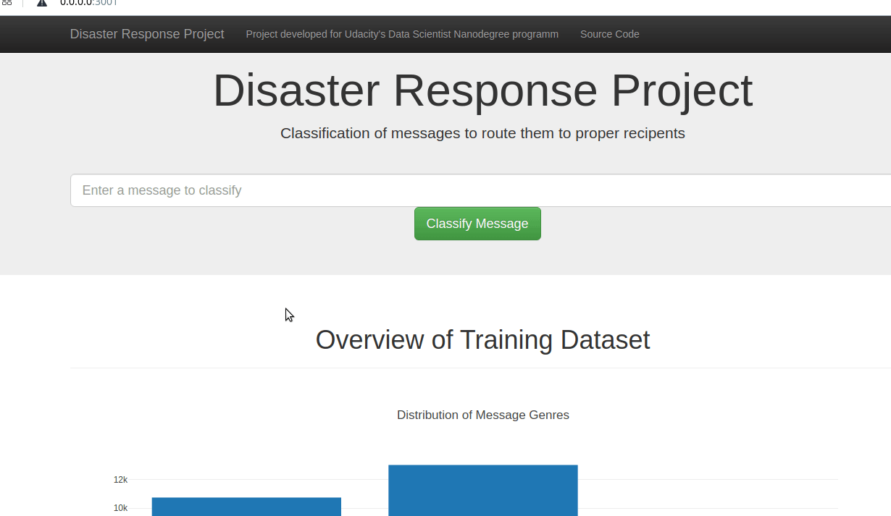

# Disaster Response Pipeline Project

### Table of Contents:

1.[Description](#description)

2.[Quickstart](#quickstart)

3.[Instructions](#instructions)

4.[Project Structure](#structure)

5.[Details on data cleaning](#datacleaning)

6.[Extension and possible improvements](#extension)

7.[Acknowledgements](#acknowledgement)

8.[Licensing](#licensing)

### Description: 
Figure Eight Data Set [Disaster Response Messages](https://www.figure-eight.com/dataset/combined-disaster-response-data/) contains several thousands of messages that have been assigned to some of 36 categories based on their content. These categories represent various emergencies.

The main goal of this project is to develop a web dashboard that can help emergency workers analyze incoming messages and sort them into specific categories to speed up aid and contribute to more efficient handling of emergency situations.
This project demonstrates, among other things, textual data handling, building an ETL- and ML-pipeline and deployment of the trianed model to the Web using Flask.

### Quickstart: 
As this repo comes with a database `data/DisasterData.db` and a RandomForest model `models/classifier_cv.pkl` to see the app in action you only need to run the following command in the app's directory to run the web app.
    `python run.py`
and then access
> http://0.0.0.0:3001/

from your browser.

### Instructions: 

1. In order to create a database and model run the following commands in the project's root directory to set up your database and model.

    - To run ETL pipeline that cleans data and stores in database `DisasterResponse.db`
        `python data/process_data.py data/disaster_messages.csv data/disaster_categories.csv data/DisasterResponse.db`
    - To run ML pipeline that trains classifier `classifier.pkl` and saves it (it can take up to several hours).
        `python models/train_classifier.py data/DisasterResponse.db models/classifier.pkl`

2. Change the database and model name in the file `run.py` (rows 43 and 48 respectively) to match the ones you created in previous step.

3. Run the following command in the app's directory to run the web app.
    `python run.py`

4. Go to http://0.0.0.0:3001/

### Project Structure: 

* app/
    * `run.py`
    * templates/
       * `master.html` - renders webpage
       * `go.html`   - renders classification results of a given message.
* models/
    * `train_classifier.py` - Python script training model on the data
    * `custom_transformers.py` - Python script with some text processing classes used in the Pipeline
    * `classifier_cv.pkl` - Pickle file containing trained model
    * `classifier_cv.csv` - CSV file with evaluation of classificator performance on Test Set (10%)
* data/
    * `process_data.py` - Python script that processes the csv data and saves it as a database
    * `DisasterData.db` - SQLite database created
    * `disaster_messages.csv` - CSV file with messages
    * `disaster_categories.csv` - CSV file with categories

* `requirements.txt` : environmental requirements; libraries
* `README.md` : You're reading it now

### Details on data cleaning: 
Upon checking the data I realized several hunderts of rows where messages contain the name of any given category aren't encoded as relevant for that category.
As a way to increase number of rows containing some of categories I decided to augument the data in a naive way: when text of message contains label keyword(s) it belongs to the category labeled by that keyword(s), for example message with "hospitals" in it belongs with certainity to the category "hospitals".
Additionally, a label named "not_related" was created as an attempt to catch all messages not related to emergency.

### Extension and possible improvements: 

The test model performance statistics are available under `data/classifier_cv`.
Due to the fact the data was heavily imbalanced, meaning many categories were underrepresented in the data because of its relative scarcity, one way to improve the model would be to obtain more data or generate synthetic data to train the model on. Besides, the impact of stopwords removal and increase of n-grams used as features can be examined. 
Additionaly, different machine learning alghorithms can be used as well as more exhaustive parameter optimization or penalization of false classifications can be done.
  

### Acknowledgement: 
This project was made as part of Udacity's Data Scientist Nanodegree. 
Special thanks goes to FigureEight for providing the data used in the project.

### Licensing: 

MIT

